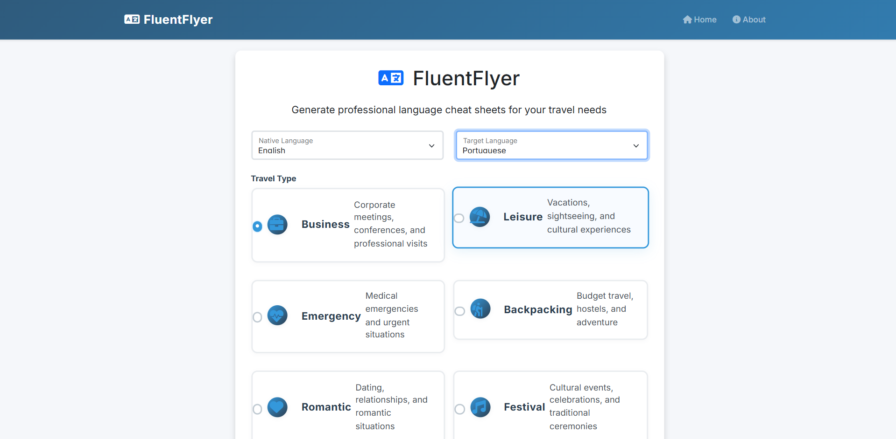

# FluentFlyer

A modern Flask web application that generates customized language cheat sheets for travelers. The application provides context-aware translations and pronunciations for various travel scenarios, helping users communicate effectively in their target language.



## Features

- Generate customized language cheat sheets for different travel scenarios:
  - Business Travel
  - Leisure Travel
  - Emergency Situations
  - Backpacking
  - Romantic Getaways
  - Festival Visits
  - Study Abroad
  - Medical Travel
  - Diplomatic Missions
  - Trade & Commerce
- Real-life scenario-based phrases for:
  - Dining & Restaurants
  - Hotels & Accommodations
  - Transportation
  - Shopping & Markets
  - Emergency & Help
  - Navigation & Sightseeing
  - Social Interactions
- Support for 20 languages including English, Spanish, French, German, Italian, Portuguese, Russian, Japanese, Chinese, Korean, Arabic, Hindi, Dutch, Swedish, Polish, Turkish, Vietnamese, Thai, Greek, and Czech
- Export cheat sheets as professionally formatted PDFs
- Listen to pronunciations using Google Text-to-Speech
- Modern, responsive user interface with Bootstrap 5
- Intuitive navigation and user experience
- Mobile-friendly design

## Prerequisites

- Python 3.8 or higher
- pip (Python package installer)

## Installation

1. Clone the repository:
```bash
git clone https://github.com/arpitjainnn14/FluentFlyer.git
cd fluentflyer
```

2. Create a virtual environment and activate it:
```bash
python -m venv venv
source venv/bin/activate  # On Windows: venv\Scripts\activate
```

3. Install the required packages:
```bash
pip install -r requirements.txt
```

## Running the Application

1. Make sure your virtual environment is activated
2. Run the Flask application:
```bash
python app.py
```
3. Open your web browser and navigate to `http://localhost:5002`

## Usage

1. Select your native language from the dropdown menu
2. Choose the target language you want to learn
3. Select your travel type or scenario
4. Click "Generate Cheat Sheet"
5. View your customized cheat sheet with translations and pronunciations
6. Use the "Export as PDF" button to download the cheat sheet
7. Click the speaker icon next to any phrase to hear its pronunciation
8. Navigate through different sections using the intuitive interface

## Technologies Used

- Flask (Python web framework)
- Bootstrap 5 (Frontend framework)
- Font Awesome (Icons)
- ReportLab (PDF generation)
- gTTS (Google Text-to-Speech)
- Flask-WTF (Form handling)
- Python-dotenv (Environment variable management)

## Contributing

Contributions are welcome! Please feel free to submit a Pull Request. For major changes, please open an issue first to discuss what you would like to change.

## License

This project is licensed under the MIT License - see the LICENSE file for details. 
